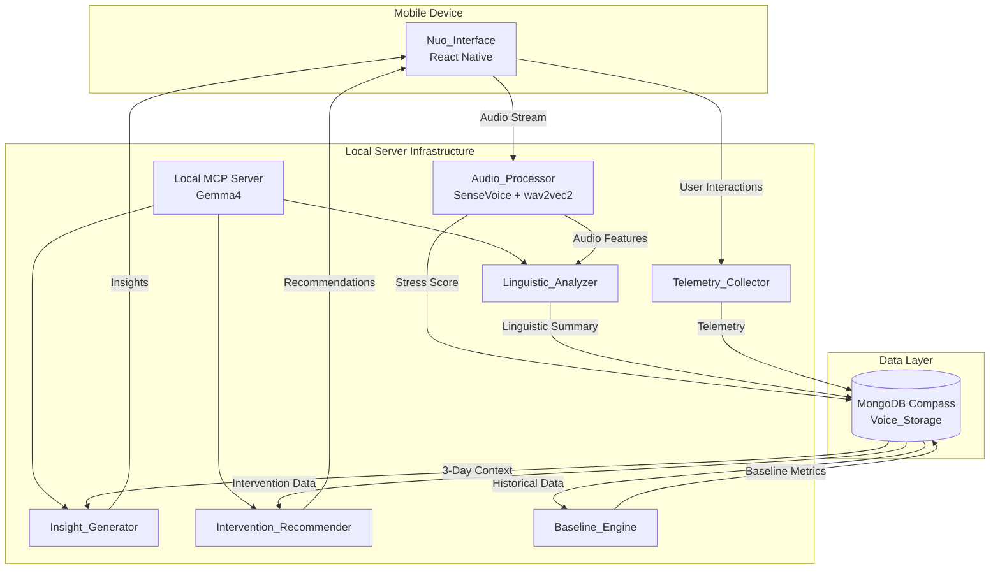
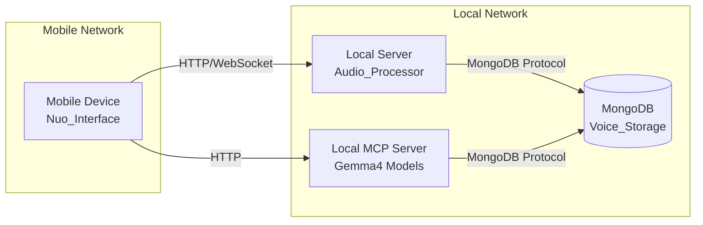
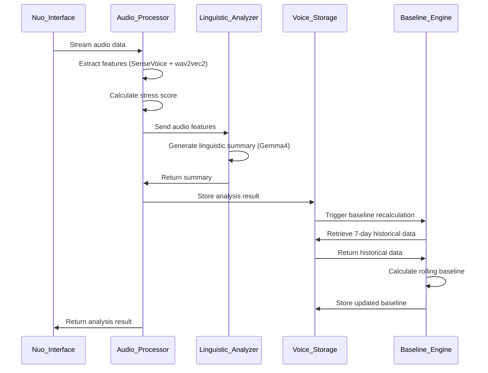
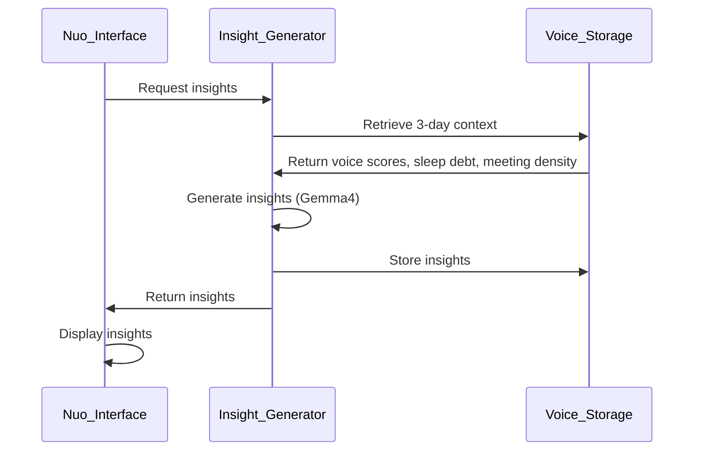
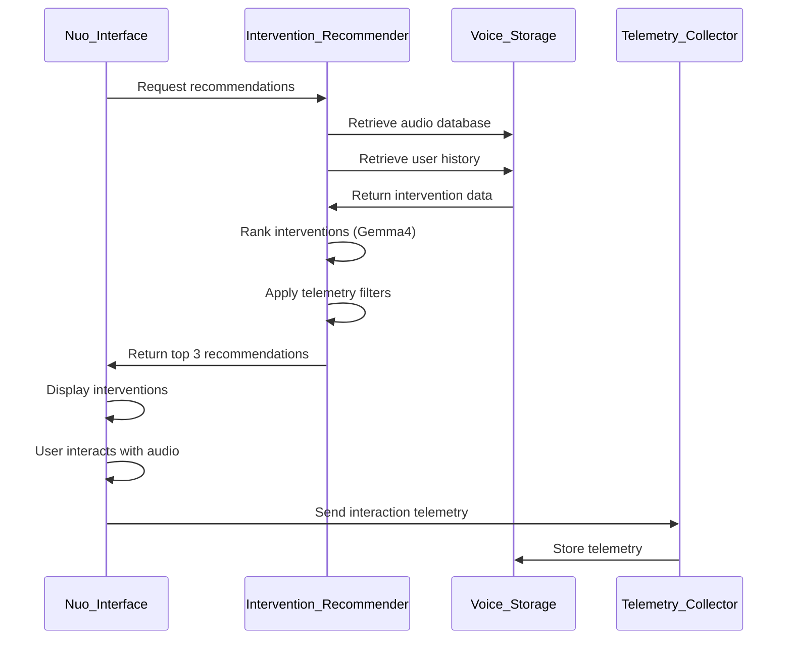

# Design Document: Voice Analysis and Intervention System

## Overview

The Voice Analysis and Intervention System is a comprehensive wellness platform that processes user voice input to detect stress levels, generates contextual insights, and recommends personalized audio interventions. The system operates entirely on local infrastructure to ensure data privacy, using React Native for the mobile interface, local ML models for analysis, and MongoDB for data persistence.

### System Goals

- **Real-time Voice Analysis**: Process voice input and calculate stress scores within 5 seconds
- **Contextual Intelligence**: Generate personalized insights using rolling historical data (3-day context, 7-day baseline)
- **Adaptive Recommendations**: Suggest audio interventions that improve over time through telemetry feedback
- **Privacy-First Architecture**: Process all sensitive data locally without external service transmission
- **Resilient Operation**: Handle component failures gracefully with retry mechanisms and offline support

### Key Components

1. **Nuo_Interface** (React Native Emergent): Mobile frontend for voice capture and result display
2. **Audio_Processor** (Local Server): SenseVoice + wav2vec2 for feature extraction and stress scoring
3. **Linguistic_Analyzer** (Local MCP Server): Gemma4 for linguistic summary generation
4. **Insight_Generator** (Local MCP Server): Gemma4 for contextual insight generation
5. **Intervention_Recommender** (Local MCP Server): Gemma4 for intervention recommendation
6. **Voice_Storage** (MongoDB Compass): Persistent storage for all voice data and telemetry
7. **Baseline_Engine**: Rolling 7-day baseline calculation component
8. **Telemetry_Collector**: User interaction tracking and feedback loop

## Architecture

### High-Level Architecture



### Component Interaction Flow

**Voice Analysis Flow:**
1. User initiates voice recording in Nuo_Interface
2. Audio stream sent to Audio_Processor
3. Audio_Processor extracts features (SenseVoice + wav2vec2) and calculates Stress_Score
4. Audio features sent to Linguistic_Analyzer (Gemma4)
5. Linguistic summary generated and returned
6. All data (features, score, summary) persisted to Voice_Storage with timestamp and user ID

**Baseline Calculation Flow:**
1. New voice data triggers Baseline_Engine
2. Baseline_Engine retrieves 7 days of historical voice scores, sleep debt, and meeting density
3. Rolling baseline calculated using weighted average algorithm
4. Updated baseline persisted to Voice_Storage

**Insight Generation Flow:**
1. User requests insights in Nuo_Interface
2. Voice_Storage retrieves 3-day rolling voice scores, sleep debt, and meeting density
3. Contextual data sent to Insight_Generator (Gemma4)
4. Insights generated with stress pattern analysis and contributing factors
5. Insights displayed in Nuo_Interface

**Intervention Recommendation Flow:**
1. User requests interventions in Nuo_Interface
2. Voice_Storage retrieves labelled audio database and user intervention history
3. Data sent to Intervention_Recommender (Gemma4)
4. Top 3 interventions ranked by relevance to current stress pattern
5. Recommendations displayed in Nuo_Interface with playback controls

**Telemetry Feedback Flow:**
1. User interacts with audio intervention (play, pause, skip, feedback)
2. Telemetry_Collector captures interaction metrics
3. Telemetry persisted to Voice_Storage
4. Future recommendations incorporate telemetry data

### Network Architecture



**Communication Protocols:**
- **Mobile to Audio_Processor**: WebSocket for audio streaming, HTTP for control messages
- **Mobile to MCP Server**: HTTP REST API for insight and intervention requests
- **Servers to MongoDB**: MongoDB wire protocol over TCP
- **All connections**: TLS encryption for data in transit

## Components and Interfaces

### 1. Nuo_Interface (React Native Frontend)

**Responsibilities:**
- Capture voice input from device microphone
- Stream audio data to Audio_Processor
- Display stress scores, insights, and intervention recommendations
- Provide audio playback controls for interventions
- Capture user interaction telemetry
- Handle offline caching and sync

**Key Interfaces:**

```typescript
interface VoiceRecordingService {
  startRecording(): Promise<void>;
  stopRecording(): Promise<AudioBuffer>;
  streamAudio(callback: (chunk: AudioChunk) => void): void;
  cancelRecording(): void;
}

interface AudioProcessorClient {
  sendAudioStream(stream: AudioStream): Promise<VoiceAnalysisResult>;
  getConnectionStatus(): ConnectionStatus;
}

interface InsightService {
  fetchInsights(userId: string): Promise<Insight[]>;
  refreshInsights(): Promise<void>;
}

interface InterventionService {
  fetchRecommendations(userId: string): Promise<Intervention[]>;
  playIntervention(interventionId: string): Promise<void>;
  recordInteraction(telemetry: InterventionTelemetry): Promise<void>;
}

interface OfflineCache {
  queueVoiceData(data: VoiceAnalysisResult): void;
  queueTelemetry(telemetry: InterventionTelemetry): void;
  syncWhenOnline(): Promise<void>;
}
```

**State Management:**
- Voice recording state (idle, recording, processing, error)
- Analysis results cache
- Insights and recommendations cache
- Offline queue for pending sync operations
- User interaction state

### 2. Audio_Processor (Local Server)

**Responsibilities:**
- Receive audio stream from Nuo_Interface
- Extract audio features using SenseVoice and wav2vec2 models
- Calculate Stress_Score from extracted features
- Return results within 5-second SLA
- Handle corrupted or invalid audio data

**Key Interfaces:**

```python
class AudioProcessor:
    def process_audio_stream(self, audio_stream: AudioStream) -> VoiceAnalysisResult:
        """
        Process incoming audio stream and return analysis results.
        
        Args:
            audio_stream: Raw audio data stream
            
        Returns:
            VoiceAnalysisResult containing features and stress score
            
        Raises:
            InvalidAudioError: If audio data is corrupted or invalid
            ProcessingTimeoutError: If processing exceeds 5 seconds
        """
        pass
    
    def extract_features(self, audio: AudioBuffer) -> AudioFeatures:
        """
        Extract audio features using SenseVoice and wav2vec2.
        
        Args:
            audio: Preprocessed audio buffer
            
        Returns:
            AudioFeatures containing embeddings and acoustic features
        """
        pass
    
    def calculate_stress_score(self, features: AudioFeatures) -> float:
        """
        Calculate stress score from audio features.
        
        Args:
            features: Extracted audio features
            
        Returns:
            Stress score in range [0.0, 1.0]
        """
        pass
```

**Processing Pipeline:**
1. **Audio Reception**: Receive WebSocket stream, buffer chunks
2. **Preprocessing**: Normalize audio, resample to model requirements (16kHz)
3. **Feature Extraction**: 
   - SenseVoice: Acoustic features (pitch, energy, spectral features)
   - wav2vec2: Contextual embeddings from speech
4. **Stress Calculation**: Weighted combination of acoustic and contextual features
5. **Result Packaging**: Format results with metadata and timestamps

**Performance Requirements:**
- Total processing time: < 5 seconds
- Feature extraction: < 3 seconds
- Stress calculation: < 1 second
- Concurrent request handling: Up to 10 simultaneous users

### 3. Linguistic_Analyzer (Gemma4 on MCP Server)

**Responsibilities:**
- Generate linguistic summaries from audio features
- Extract key themes and emotional indicators
- Return summaries within 3-second SLA
- Handle model unavailability gracefully

**Key Interfaces:**

```python
class LinguisticAnalyzer:
    def generate_summary(self, audio_features: AudioFeatures) -> LinguisticSummary:
        """
        Generate linguistic summary from audio features using Gemma4.
        
        Args:
            audio_features: Extracted audio features from Audio_Processor
            
        Returns:
            LinguisticSummary containing themes and emotional indicators
            
        Raises:
            ModelUnavailableError: If Gemma4 model is not accessible
            GenerationTimeoutError: If generation exceeds 3 seconds
        """
        pass
    
    def extract_themes(self, features: AudioFeatures) -> List[Theme]:
        """Extract key themes from speech features."""
        pass
    
    def detect_emotions(self, features: AudioFeatures) -> EmotionalIndicators:
        """Detect emotional indicators from speech features."""
        pass
```

**Gemma4 Prompt Template:**
```
Given the following audio features extracted from user speech:
- Acoustic features: {acoustic_features}
- Contextual embeddings: {embeddings}
- Prosodic features: {prosody}

Generate a concise linguistic summary that includes:
1. Key themes discussed
2. Emotional indicators (stress, anxiety, calmness, etc.)
3. Speech patterns (hesitation, rapid speech, etc.)

Format the response as JSON with fields: themes, emotions, patterns.
```

### 4. Baseline_Engine

**Responsibilities:**
- Calculate rolling 7-day baseline metrics
- Incorporate voice scores, sleep debt, and meeting density
- Trigger recalculation on new voice data
- Complete calculation within 1-second SLA

**Key Interfaces:**

```python
class BaselineEngine:
    def calculate_baseline(self, user_id: str) -> BaselineMetrics:
        """
        Calculate 7-day rolling baseline for user.
        
        Args:
            user_id: User identifier
            
        Returns:
            BaselineMetrics containing baseline stress, sleep debt, meeting density
            
        Raises:
            InsufficientDataError: If less than 3 days of data available
        """
        pass
    
    def retrieve_historical_data(self, user_id: str, days: int) -> HistoricalData:
        """Retrieve historical data from Voice_Storage."""
        pass
    
    def compute_weighted_average(self, data: HistoricalData) -> float:
        """Compute weighted average with recent data weighted higher."""
        pass
```

**Baseline Calculation Algorithm:**

```python
def calculate_baseline(voice_scores, sleep_debt, meeting_density):
    """
    Calculate baseline using weighted average with exponential decay.
    
    Recent data is weighted more heavily than older data.
    """
    # Exponential decay weights (more recent = higher weight)
    weights = [exp(-0.2 * i) for i in range(7)]
    weights = [w / sum(weights) for w in weights]  # Normalize
    
    # Calculate weighted averages
    baseline_stress = sum(w * score for w, score in zip(weights, voice_scores))
    baseline_sleep_debt = sum(w * debt for w, debt in zip(weights, sleep_debt))
    baseline_meeting_density = sum(w * density for w, density in zip(weights, meeting_density))
    
    return BaselineMetrics(
        stress=baseline_stress,
        sleep_debt=baseline_sleep_debt,
        meeting_density=baseline_meeting_density,
        calculation_date=datetime.now()
    )
```

### 5. Insight_Generator (Gemma4 on MCP Server)

**Responsibilities:**
- Generate contextual insights using 3-day rolling data
- Analyze stress patterns and contributing factors
- Return insights within 5-second SLA
- Handle model unavailability gracefully

**Key Interfaces:**

```python
class InsightGenerator:
    def generate_insights(self, context: UserContext) -> List[Insight]:
        """
        Generate personalized insights using Gemma4.
        
        Args:
            context: UserContext containing 3-day rolling data
            
        Returns:
            List of Insight objects with stress analysis and recommendations
            
        Raises:
            ModelUnavailableError: If Gemma4 model is not accessible
            GenerationTimeoutError: If generation exceeds 5 seconds
        """
        pass
    
    def analyze_stress_patterns(self, voice_scores: List[float]) -> StressPattern:
        """Identify stress patterns in voice score time series."""
        pass
    
    def identify_contributing_factors(self, context: UserContext) -> List[Factor]:
        """Identify factors contributing to stress (sleep, meetings, etc.)."""
        pass
```

**Gemma4 Prompt Template:**
```
Analyze the following user data from the past 3 days:

Voice Stress Scores: {voice_scores}
Sleep Debt: {sleep_debt}
Meeting Density: {meeting_density}
Baseline Metrics: {baseline}

Generate personalized insights that:
1. Identify stress patterns (increasing, decreasing, stable, volatile)
2. Correlate stress with sleep debt and meeting density
3. Highlight deviations from baseline
4. Suggest potential contributing factors
5. Provide actionable observations

Format as JSON with fields: pattern, correlations, deviations, factors, observations.
```

### 6. Intervention_Recommender (Gemma4 on MCP Server)

**Responsibilities:**
- Recommend top 3 audio interventions
- Rank by relevance to current stress pattern
- Incorporate user history and telemetry feedback
- Return recommendations within 5-second SLA

**Key Interfaces:**

```python
class InterventionRecommender:
    def recommend_interventions(
        self, 
        user_context: UserContext,
        audio_database: List[AudioIntervention],
        user_history: InterventionHistory
    ) -> List[InterventionRecommendation]:
        """
        Recommend top 3 audio interventions using Gemma4.
        
        Args:
            user_context: Current user stress context
            audio_database: Labelled audio intervention database
            user_history: User's intervention interaction history
            
        Returns:
            List of 3 InterventionRecommendation objects ranked by relevance
            
        Raises:
            ModelUnavailableError: If Gemma4 model is not accessible
            GenerationTimeoutError: If generation exceeds 5 seconds
        """
        pass
    
    def rank_by_relevance(
        self, 
        interventions: List[AudioIntervention],
        stress_pattern: StressPattern
    ) -> List[AudioIntervention]:
        """Rank interventions by relevance to stress pattern."""
        pass
    
    def apply_telemetry_filter(
        self,
        interventions: List[AudioIntervention],
        telemetry: InterventionHistory
    ) -> List[AudioIntervention]:
        """Filter and adjust rankings based on user telemetry."""
        pass
```

**Gemma4 Prompt Template:**
```
Recommend audio interventions for a user with the following profile:

Current Stress Pattern: {stress_pattern}
Recent Stress Scores: {voice_scores}
Sleep Debt: {sleep_debt}
Meeting Density: {meeting_density}

Available Interventions:
{audio_database}

User History:
- Previously liked: {liked_interventions}
- Previously skipped: {skipped_interventions}
- Interaction patterns: {interaction_patterns}

Recommend the top 3 interventions that:
1. Match the user's current stress pattern
2. Align with previously liked interventions
3. Avoid repeatedly skipped interventions
4. Provide variety in intervention types

Format as JSON array with fields: intervention_id, relevance_score, reasoning.
```

**Telemetry-Based Filtering Rules:**
- **Skip threshold**: If intervention skipped 3+ times, reduce relevance score by 50%
- **Like boost**: If similar intervention liked, increase relevance score by 30%
- **Recency penalty**: If intervention used in last 7 days, reduce score by 20%
- **Completion bonus**: If intervention completed (>80% play duration), increase similar interventions by 25%

### 7. Telemetry_Collector

**Responsibilities:**
- Capture user interaction events with audio interventions
- Persist telemetry to Voice_Storage within 1 second
- Support offline queuing and sync
- Provide telemetry data for recommendation feedback loop

**Key Interfaces:**

```python
class TelemetryCollector:
    def record_interaction(self, telemetry: InterventionTelemetry) -> None:
        """
        Record user interaction with audio intervention.
        
        Args:
            telemetry: InterventionTelemetry containing interaction metrics
            
        Raises:
            PersistenceError: If telemetry cannot be persisted after retries
        """
        pass
    
    def capture_play_event(
        self,
        audio_id: str,
        audio_url: str,
        play_duration: float,
        total_duration: float
    ) -> InterventionTelemetry:
        """Capture audio play event with duration metrics."""
        pass
    
    def capture_feedback_event(
        self,
        audio_id: str,
        like_status: bool,
        feedback_text: Optional[str]
    ) -> InterventionTelemetry:
        """Capture user feedback event."""
        pass
    
    def calculate_skip_status(
        self,
        play_duration: float,
        total_duration: float
    ) -> SkipStatus:
        """
        Calculate skip status based on play duration.
        
        Returns:
            SkipStatus with flags for early_skip (<5s) and partial_skip (<50%)
        """
        pass
```

**Telemetry Data Capture:**
- **Play Events**: audio_id, audio_url, play_duration, total_duration, timestamp
- **Skip Detection**: early_skip (< 5 seconds), partial_skip (< 50% duration)
- **Feedback Events**: like/dislike status, optional text feedback
- **Session Context**: user_id, stress_score at time of interaction, device info

### 8. Voice_Storage (MongoDB)

**Responsibilities:**
- Persist voice analysis results, baselines, insights, and telemetry
- Provide fast retrieval for historical data queries
- Ensure data integrity and consistency
- Support concurrent read/write operations
- Encrypt sensitive data at rest

**Key Interfaces:**

```python
class VoiceStorage:
    def store_voice_analysis(self, analysis: VoiceAnalysisResult) -> str:
        """Store voice analysis result and return document ID."""
        pass
    
    def store_baseline(self, baseline: BaselineMetrics) -> str:
        """Store baseline metrics."""
        pass
    
    def store_telemetry(self, telemetry: InterventionTelemetry) -> str:
        """Store intervention telemetry."""
        pass
    
    def retrieve_historical_voice_scores(
        self,
        user_id: str,
        days: int
    ) -> List[VoiceScore]:
        """Retrieve historical voice scores for specified days."""
        pass
    
    def retrieve_user_context(self, user_id: str, days: int) -> UserContext:
        """Retrieve complete user context including scores, sleep, meetings."""
        pass
    
    def retrieve_intervention_database(self) -> List[AudioIntervention]:
        """Retrieve labelled audio intervention database."""
        pass
    
    def retrieve_user_intervention_history(
        self,
        user_id: str
    ) -> InterventionHistory:
        """Retrieve user's intervention interaction history."""
        pass
```

## Data Models

### Voice Analysis Collection

```typescript
interface VoiceAnalysisDocument {
  _id: ObjectId;
  user_id: string;  // Anonymized user identifier
  timestamp: Date;
  
  // Audio features
  audio_features: {
    sensevoice_features: {
      pitch: number[];
      energy: number[];
      spectral_features: number[];
      mfcc: number[];
    };
    wav2vec2_embeddings: number[];  // 768-dimensional embedding
  };
  
  // Stress score
  stress_score: number;  // Range [0.0, 1.0]
  
  // Linguistic summary
  linguistic_summary: {
    themes: string[];
    emotions: {
      stress: number;
      anxiety: number;
      calmness: number;
    };
    patterns: string[];
  };
  
  // Metadata
  audio_duration_seconds: number;
  processing_time_ms: number;
  model_versions: {
    sensevoice: string;
    wav2vec2: string;
    gemma4: string;
  };
}
```

**Indexes:**
- `{ user_id: 1, timestamp: -1 }` - For historical queries
- `{ user_id: 1, stress_score: 1 }` - For stress pattern analysis
- `{ timestamp: -1 }` - For time-based queries

### Baseline Metrics Collection

```typescript
interface BaselineDocument {
  _id: ObjectId;
  user_id: string;
  calculation_date: Date;
  
  // Baseline metrics
  baseline_stress: number;
  baseline_sleep_debt: number;  // Hours
  baseline_meeting_density: number;  // Meetings per hour
  
  // Calculation metadata
  data_points_used: number;
  date_range: {
    start: Date;
    end: Date;
  };
  
  // Historical for comparison
  previous_baseline_stress: number;
  change_percentage: number;
}
```

**Indexes:**
- `{ user_id: 1, calculation_date: -1 }` - For latest baseline retrieval
- `{ user_id: 1 }` - For user-specific queries

### Contextual Data Collection

```typescript
interface ContextualDataDocument {
  _id: ObjectId;
  user_id: string;
  date: Date;
  
  // Daily aggregates
  sleep_debt_hours: number;
  meeting_count: number;
  meeting_duration_minutes: number;
  meeting_density: number;  // Meetings per hour
  
  // Voice score aggregates
  daily_avg_stress: number;
  daily_max_stress: number;
  daily_min_stress: number;
  voice_sample_count: number;
}
```

**Indexes:**
- `{ user_id: 1, date: -1 }` - For rolling window queries
- `{ user_id: 1 }` - For user-specific queries

### Audio Intervention Database Collection

```typescript
interface AudioInterventionDocument {
  _id: ObjectId;
  audio_id: string;  // Unique intervention identifier
  audio_url: string;
  
  // Metadata
  title: string;
  description: string;
  duration_seconds: number;
  
  // Categorization
  category: string;  // e.g., "breathing", "meditation", "music"
  subcategory: string;
  tags: string[];
  
  // Effectiveness metrics
  effectiveness_rating: number;  // Range [0.0, 1.0]
  usage_count: number;
  average_completion_rate: number;
  
  // Target stress patterns
  target_stress_range: {
    min: number;
    max: number;
  };
  recommended_for: string[];  // e.g., ["high_stress", "anxiety", "sleep"]
}
```

**Indexes:**
- `{ category: 1, effectiveness_rating: -1 }` - For category-based recommendations
- `{ audio_id: 1 }` - For direct lookup
- `{ tags: 1 }` - For tag-based search

### Intervention Telemetry Collection

```typescript
interface InterventionTelemetryDocument {
  _id: ObjectId;
  user_id: string;
  audio_id: string;
  audio_url: string;
  timestamp: Date;
  
  // Interaction metrics
  play_duration_seconds: number;
  total_duration_seconds: number;
  completion_percentage: number;
  
  // Skip status
  early_skip: boolean;  // < 5 seconds
  partial_skip: boolean;  // < 50% duration
  completed: boolean;  // > 80% duration
  
  // User feedback
  like_status: boolean | null;
  dislike_status: boolean | null;
  feedback_text: string | null;
  
  // Context at time of interaction
  stress_score_at_interaction: number;
  session_id: string;
  device_info: {
    platform: string;
    app_version: string;
  };
}
```

**Indexes:**
- `{ user_id: 1, timestamp: -1 }` - For user history retrieval
- `{ audio_id: 1, user_id: 1 }` - For per-intervention user history
- `{ user_id: 1, like_status: 1 }` - For liked interventions
- `{ user_id: 1, early_skip: 1 }` - For skipped interventions

### Insights Collection

```typescript
interface InsightDocument {
  _id: ObjectId;
  user_id: string;
  generation_date: Date;
  
  // Insight content
  stress_pattern: string;  // e.g., "increasing", "stable", "volatile"
  pattern_description: string;
  
  // Correlations
  correlations: {
    sleep_correlation: number;  // Range [-1.0, 1.0]
    meeting_correlation: number;
  };
  
  // Deviations from baseline
  deviations: {
    stress_deviation: number;  // Percentage
    sleep_deviation: number;
    meeting_deviation: number;
  };
  
  // Contributing factors
  contributing_factors: string[];
  
  // Actionable observations
  observations: string[];
  
  // Context used for generation
  context_window: {
    start_date: Date;
    end_date: Date;
    data_points: number;
  };
}
```

**Indexes:**
- `{ user_id: 1, generation_date: -1 }` - For latest insights retrieval
- `{ user_id: 1 }` - For user-specific queries

## Data Flow Diagrams

### Voice Analysis Data Flow



### Insight Generation Data Flow



### Intervention Recommendation Data Flow




## Error Handling

### Error Categories and Strategies

#### 1. Audio Processing Errors

**Invalid Audio Data:**
- **Detection**: Audio format validation, corruption checks
- **Response**: Return `InvalidAudioError` with error code and description
- **User Experience**: Display error message, allow retry
- **Logging**: Log audio metadata, error details for debugging

**Processing Timeout:**
- **Detection**: Processing time exceeds 5-second SLA
- **Response**: Cancel processing, return `ProcessingTimeoutError`
- **User Experience**: Display timeout message, suggest retry
- **Mitigation**: Implement processing queue with priority handling

**Model Loading Failure:**
- **Detection**: SenseVoice or wav2vec2 model fails to load
- **Response**: Return `ModelUnavailableError`
- **User Experience**: Display service unavailable message
- **Recovery**: Automatic model reload attempt, fallback to cached results if available

#### 2. AI Model Errors

**Gemma4 Unavailability:**
- **Detection**: MCP server connection failure or model timeout
- **Response**: Return `ModelUnavailableError` with specific model identifier
- **User Experience**: Display service unavailable message, show cached insights/recommendations
- **Recovery**: Retry with exponential backoff (1s, 2s, 4s), max 3 attempts
- **Fallback**: Use rule-based recommendations if Gemma4 unavailable for >30 seconds

**Generation Timeout:**
- **Detection**: Gemma4 generation exceeds SLA (3s for linguistic, 5s for insights/interventions)
- **Response**: Cancel generation, return `GenerationTimeoutError`
- **User Experience**: Display timeout message, offer cached results
- **Mitigation**: Implement generation timeout at model level, optimize prompts

**Invalid Model Output:**
- **Detection**: Gemma4 returns malformed JSON or unexpected format
- **Response**: Log error, attempt to parse partial response
- **User Experience**: Display partial results or fallback message
- **Recovery**: Retry with simplified prompt

#### 3. Database Errors

**Connection Failure:**
- **Detection**: MongoDB connection timeout or network error
- **Response**: Return `DatabaseUnavailableError`
- **User Experience**: Display connection error, enable offline mode
- **Recovery**: Retry connection with exponential backoff, max 3 attempts
- **Fallback**: Queue operations for later sync

**Write Failure:**
- **Detection**: Document insertion/update fails
- **Response**: Retry up to 3 times with 1-second delay
- **User Experience**: Display save error if all retries fail
- **Data Integrity**: Use transactions for multi-document operations
- **Fallback**: Cache data locally, sync when connection restored

**Query Timeout:**
- **Detection**: Query exceeds 2-second SLA
- **Response**: Cancel query, return `QueryTimeoutError`
- **User Experience**: Display timeout message, suggest retry
- **Mitigation**: Optimize indexes, implement query result caching

**Insufficient Data:**
- **Detection**: Less than minimum required data points for baseline calculation
- **Response**: Return `InsufficientDataError` with required vs. available count
- **User Experience**: Display message explaining data collection period
- **Fallback**: Use partial baseline or skip baseline comparison

#### 4. Network Errors

**Connection Loss:**
- **Detection**: Network connectivity check fails
- **Response**: Enable offline mode
- **User Experience**: Display offline indicator, explain limited functionality
- **Recovery**: Monitor connectivity, auto-sync when restored
- **Offline Support**: Cache voice data, telemetry, and user interactions locally

**Request Timeout:**
- **Detection**: HTTP/WebSocket request exceeds timeout threshold
- **Response**: Cancel request, return `RequestTimeoutError`
- **User Experience**: Display timeout message, allow retry
- **Retry Strategy**: Exponential backoff with jitter

**Partial Data Transfer:**
- **Detection**: Audio stream interrupted mid-transfer
- **Response**: Discard partial data, notify user
- **User Experience**: Display transfer error, allow re-recording
- **Prevention**: Implement chunked transfer with acknowledgments

### Error Handling Patterns

#### Retry with Exponential Backoff

```python
def retry_with_backoff(
    operation: Callable,
    max_attempts: int = 3,
    base_delay: float = 1.0,
    max_delay: float = 10.0
) -> Any:
    """
    Retry operation with exponential backoff.
    
    Args:
        operation: Function to retry
        max_attempts: Maximum number of retry attempts
        base_delay: Initial delay in seconds
        max_delay: Maximum delay in seconds
        
    Returns:
        Result of successful operation
        
    Raises:
        Last exception if all attempts fail
    """
    for attempt in range(max_attempts):
        try:
            return operation()
        except Exception as e:
            if attempt == max_attempts - 1:
                raise
            
            delay = min(base_delay * (2 ** attempt), max_delay)
            jitter = random.uniform(0, 0.1 * delay)
            time.sleep(delay + jitter)
            
            logger.warning(
                f"Attempt {attempt + 1} failed: {e}. "
                f"Retrying in {delay:.2f}s..."
            )
```

#### Circuit Breaker Pattern

```python
class CircuitBreaker:
    """
    Circuit breaker to prevent cascading failures.
    
    States:
    - CLOSED: Normal operation, requests pass through
    - OPEN: Failure threshold exceeded, requests fail fast
    - HALF_OPEN: Testing if service recovered
    """
    
    def __init__(
        self,
        failure_threshold: int = 5,
        recovery_timeout: float = 60.0,
        success_threshold: int = 2
    ):
        self.failure_threshold = failure_threshold
        self.recovery_timeout = recovery_timeout
        self.success_threshold = success_threshold
        
        self.failure_count = 0
        self.success_count = 0
        self.last_failure_time = None
        self.state = "CLOSED"
    
    def call(self, operation: Callable) -> Any:
        """Execute operation through circuit breaker."""
        if self.state == "OPEN":
            if time.time() - self.last_failure_time > self.recovery_timeout:
                self.state = "HALF_OPEN"
                self.success_count = 0
            else:
                raise CircuitBreakerOpenError("Service unavailable")
        
        try:
            result = operation()
            self._on_success()
            return result
        except Exception as e:
            self._on_failure()
            raise
    
    def _on_success(self):
        """Handle successful operation."""
        self.failure_count = 0
        
        if self.state == "HALF_OPEN":
            self.success_count += 1
            if self.success_count >= self.success_threshold:
                self.state = "CLOSED"
    
    def _on_failure(self):
        """Handle failed operation."""
        self.failure_count += 1
        self.last_failure_time = time.time()
        
        if self.failure_count >= self.failure_threshold:
            self.state = "OPEN"
```

#### Graceful Degradation

```python
class GracefulDegradation:
    """
    Provide fallback functionality when primary services fail.
    """
    
    def get_insights_with_fallback(self, user_id: str) -> List[Insight]:
        """
        Get insights with fallback to cached or rule-based insights.
        """
        try:
            # Primary: Gemma4-generated insights
            return self.insight_generator.generate_insights(user_id)
        except ModelUnavailableError:
            logger.warning("Gemma4 unavailable, using cached insights")
            
            # Fallback 1: Cached insights from last successful generation
            cached = self.cache.get_insights(user_id)
            if cached and self._is_recent(cached, hours=24):
                return cached
            
            # Fallback 2: Rule-based insights
            logger.warning("No recent cache, using rule-based insights")
            return self._generate_rule_based_insights(user_id)
    
    def _generate_rule_based_insights(self, user_id: str) -> List[Insight]:
        """
        Generate basic insights using rule-based logic.
        """
        context = self.storage.retrieve_user_context(user_id, days=3)
        
        insights = []
        
        # Rule 1: High stress detection
        if context.avg_stress > 0.7:
            insights.append(Insight(
                pattern="high_stress",
                description="Your stress levels have been elevated recently."
            ))
        
        # Rule 2: Sleep correlation
        if context.sleep_debt > 2.0 and context.avg_stress > 0.6:
            insights.append(Insight(
                pattern="sleep_stress_correlation",
                description="Lack of sleep may be contributing to stress."
            ))
        
        # Rule 3: Meeting density
        if context.meeting_density > 0.5 and context.avg_stress > 0.6:
            insights.append(Insight(
                pattern="meeting_stress_correlation",
                description="High meeting density may be increasing stress."
            ))
        
        return insights
```

### Error Logging and Monitoring

**Structured Logging:**
```python
logger.error(
    "Audio processing failed",
    extra={
        "user_id": user_id,
        "audio_duration": audio_duration,
        "error_type": type(e).__name__,
        "error_message": str(e),
        "processing_stage": "feature_extraction",
        "timestamp": datetime.now().isoformat()
    }
)
```

**Error Metrics:**
- Error rate by component (Audio_Processor, Gemma4, MongoDB)
- Error rate by type (timeout, unavailable, invalid data)
- Recovery success rate
- Fallback usage frequency
- User-facing error frequency

**Alerting Thresholds:**
- Error rate > 5% for any component: Warning
- Error rate > 10% for any component: Critical
- Gemma4 unavailable > 5 minutes: Critical
- MongoDB unavailable > 1 minute: Critical
- Audio processing timeout rate > 10%: Warning

## Testing Strategy

### Testing Approach

The Voice Analysis and Intervention System requires a comprehensive testing strategy that combines unit tests, integration tests, and property-based tests. Given the system's architecture involving audio processing, AI models, and data persistence, we will employ different testing strategies for different components.

### Unit Testing

**Scope:**
- Individual component logic
- Data transformation functions
- Calculation algorithms
- Error handling paths
- Edge cases and boundary conditions

**Key Areas:**

1. **Audio Processing:**
   - Audio format validation
   - Feature extraction output format
   - Stress score calculation with known inputs
   - Error handling for corrupted audio

2. **Baseline Calculation:**
   - Weighted average algorithm
   - Exponential decay weights
   - Insufficient data handling
   - Edge cases (single data point, missing data)

3. **Telemetry Collection:**
   - Skip status calculation
   - Completion percentage calculation
   - Telemetry data formatting
   - Edge cases (zero duration, negative values)

4. **Data Models:**
   - Schema validation
   - Data serialization/deserialization
   - Field constraints and defaults

**Example Unit Tests:**

```python
def test_stress_score_calculation():
    """Test stress score calculation with known features."""
    features = AudioFeatures(
        pitch=[100, 120, 110],
        energy=[0.5, 0.6, 0.55],
        embeddings=[0.1] * 768
    )
    score = calculate_stress_score(features)
    assert 0.0 <= score <= 1.0

def test_skip_status_early_skip():
    """Test early skip detection (<5 seconds)."""
    skip_status = calculate_skip_status(
        play_duration=3.0,
        total_duration=60.0
    )
    assert skip_status.early_skip is True
    assert skip_status.partial_skip is True

def test_baseline_insufficient_data():
    """Test baseline calculation with insufficient data."""
    with pytest.raises(InsufficientDataError):
        calculate_baseline(user_id="test", days=7)
```

### Integration Testing

**Scope:**
- Component interactions
- End-to-end workflows
- External service integration (MongoDB, Gemma4)
- Network communication
- Error propagation

**Key Areas:**

1. **Voice Analysis Workflow:**
   - Audio capture → Processing → Storage
   - Feature extraction → Linguistic analysis
   - Baseline recalculation trigger

2. **Insight Generation Workflow:**
   - Data retrieval → Gemma4 generation → Storage → Display
   - Error handling and fallback

3. **Intervention Recommendation Workflow:**
   - Database retrieval → Gemma4 ranking → Telemetry filtering
   - User interaction → Telemetry capture → Storage

4. **Offline Sync:**
   - Data queuing during offline mode
   - Sync when connectivity restored
   - Conflict resolution

**Example Integration Tests:**

```python
@pytest.mark.integration
def test_voice_analysis_end_to_end():
    """Test complete voice analysis workflow."""
    # Arrange
    audio_stream = load_test_audio("sample.wav")
    
    # Act
    result = audio_processor.process_audio_stream(audio_stream)
    
    # Assert
    assert result.stress_score is not None
    assert result.linguistic_summary is not None
    assert voice_storage.retrieve_latest(user_id) == result

@pytest.mark.integration
def test_gemma4_unavailable_fallback():
    """Test fallback when Gemma4 is unavailable."""
    # Arrange
    mock_gemma4_unavailable()
    
    # Act
    insights = insight_service.get_insights(user_id)
    
    # Assert
    assert insights is not None  # Should return cached or rule-based
    assert insights[0].source == "rule_based"
```

### Property-Based Testing

**Applicability Assessment:**

Property-based testing is appropriate for this system in specific areas:

✅ **Suitable for PBT:**
- Baseline calculation algorithm (mathematical properties)
- Telemetry skip status calculation (logical properties)
- Data serialization/deserialization (round-trip properties)
- Stress score normalization (range invariants)

❌ **Not suitable for PBT:**
- Audio processing (external ML models, not pure functions)
- Gemma4 generation (non-deterministic AI output)
- UI rendering (React Native components)
- MongoDB operations (external service integration)
- Network communication (I/O operations)

**Property-Based Testing Library:**
- **Python**: Hypothesis
- **TypeScript/JavaScript**: fast-check

**Configuration:**
- Minimum 100 iterations per property test
- Each test tagged with design property reference


## Correctness Properties

*A property is a characteristic or behavior that should hold true across all valid executions of a system—essentially, a formal statement about what the system should do. Properties serve as the bridge between human-readable specifications and machine-verifiable correctness guarantees.*

### Property 1: Stress Score Range Invariant

*For any* valid audio features extracted from user voice input, the calculated stress score SHALL always be within the range [0.0, 1.0] inclusive.

**Validates: Requirements 2.2**

**Rationale**: The stress score is a normalized metric that must remain within bounds regardless of input audio characteristics. This invariant ensures the score is always interpretable and can be safely used in downstream calculations and comparisons.

### Property 2: Invalid Audio Error Handling

*For any* corrupted or invalid audio data, the Audio_Processor SHALL return an error code and SHALL NOT return a stress score or audio features.

**Validates: Requirements 2.4**

**Rationale**: The system must reliably detect and reject invalid inputs to prevent propagation of erroneous data through the analysis pipeline.

### Property 3: Data Persistence Round-Trip

*For any* voice analysis result (including audio features, stress score, linguistic summary, and user identifier), storing the data to Voice_Storage and then retrieving it SHALL return data equivalent to the original.

**Validates: Requirements 4.1, 4.2, 6.3, 14.1**

**Rationale**: Data integrity is fundamental to the system. All persisted data must be retrievable without loss or corruption, ensuring historical analysis and baseline calculations are accurate.

### Property 4: Baseline Within Historical Range

*For any* set of historical voice scores used in baseline calculation, the calculated baseline stress score SHALL be greater than or equal to the minimum historical score AND less than or equal to the maximum historical score.

**Validates: Requirements 6.1**

**Rationale**: The baseline is a weighted average of historical data, so it must fall within the range of input values. This property ensures the baseline calculation doesn't produce nonsensical results.

### Property 5: Baseline Sensitivity to Input Changes

*For any* baseline calculation, changing any of the input data (voice scores, sleep debt, or meeting density) SHALL result in a different baseline value, unless the new input is identical to the old input.

**Validates: Requirements 6.2**

**Rationale**: The baseline must be responsive to all three data sources. If changing an input doesn't affect the baseline, that input is not being incorporated into the calculation as required.

### Property 6: Intervention Database Schema Completeness

*For any* audio intervention record retrieved from the labelled audio database, the record SHALL contain all required fields: audio_id, audio_url, title, description, duration_seconds, category, and effectiveness_rating.

**Validates: Requirements 10.4**

**Rationale**: The intervention recommendation system depends on complete metadata for each intervention. Missing fields would cause recommendation failures or incorrect rankings.

### Property 7: Recommendation Ranking Order

*For any* set of intervention recommendations returned by the Intervention_Recommender, the recommendations SHALL be ordered in descending order by relevance score (highest relevance first).

**Validates: Requirements 11.3**

**Rationale**: Users expect the most relevant interventions to be presented first. This property ensures the ranking logic is correctly applied.

### Property 8: Telemetry Data Completeness

*For any* user interaction with an audio intervention, the captured telemetry SHALL include all required fields: audio_id, audio_url, play_duration, timestamp, and user_id.

**Validates: Requirements 13.1, 13.2**

**Rationale**: Complete telemetry data is essential for the feedback loop. Missing fields would prevent accurate analysis of user preferences and intervention effectiveness.

### Property 9: Skip Status Calculation Correctness

*For any* audio intervention interaction with play_duration and total_duration:
- IF play_duration < 5 seconds, THEN early_skip SHALL be true
- IF play_duration < (0.5 * total_duration), THEN partial_skip SHALL be true
- IF play_duration >= (0.8 * total_duration), THEN completed SHALL be true

**Validates: Requirements 13.3**

**Rationale**: Skip status calculation is deterministic logic that must be consistent across all interactions. These thresholds are used to infer user preferences and improve recommendations.

### Property 10: Telemetry Feedback Impact on Recommendations

*For any* intervention recommendation request:
- IF an intervention has been skipped 3 or more times by the user, THEN its relevance score SHALL be reduced compared to the score without telemetry
- IF an intervention similar to a previously liked intervention is recommended, THEN its relevance score SHALL be increased compared to the score without telemetry

**Validates: Requirements 14.2, 14.3, 14.4**

**Rationale**: The recommendation system must learn from user behavior. Telemetry data should demonstrably affect recommendation rankings to create a personalized experience.

### Property 11: Offline Data Queue Completeness

*For any* data that fails to persist to Voice_Storage due to unavailability, the data SHALL be added to the offline queue, and when connectivity is restored, all queued data SHALL be synced to Voice_Storage.

**Validates: Requirements 15.3, 15.4**

**Rationale**: No user data should be lost due to temporary connectivity issues. The offline queue must reliably preserve all data until it can be persisted.

### Property 12: User Identifier Anonymization

*For any* voice analysis record stored in Voice_Storage, the user_id field SHALL NOT contain personally identifiable information (PII) such as email addresses, phone numbers, or real names. The user_id SHALL be an anonymized identifier (e.g., UUID or cryptographic hash).

**Validates: Requirements 16.3**

**Rationale**: Privacy protection requires that user identifiers cannot be used to directly identify individuals. Anonymized identifiers protect user privacy while still allowing data association.

### Property Testing Implementation

**Testing Library**: Hypothesis (Python) and fast-check (TypeScript/JavaScript)

**Test Configuration**:
- Minimum 100 iterations per property test
- Each test tagged with format: `Feature: voice-analysis-intervention-system, Property {number}: {property_title}`

**Example Property Test Structure**:

```python
from hypothesis import given, strategies as st
import pytest

@given(
    pitch=st.lists(st.floats(min_value=50, max_value=500), min_size=1, max_size=100),
    energy=st.lists(st.floats(min_value=0.0, max_value=1.0), min_size=1, max_size=100),
    embeddings=st.lists(st.floats(), min_size=768, max_size=768)
)
@pytest.mark.property_test
def test_property_1_stress_score_range_invariant(pitch, energy, embeddings):
    """
    Feature: voice-analysis-intervention-system, Property 1: Stress Score Range Invariant
    
    For any valid audio features, stress score must be in [0.0, 1.0].
    """
    features = AudioFeatures(
        sensevoice_features={"pitch": pitch, "energy": energy},
        wav2vec2_embeddings=embeddings
    )
    
    stress_score = calculate_stress_score(features)
    
    assert 0.0 <= stress_score <= 1.0, \
        f"Stress score {stress_score} outside valid range [0.0, 1.0]"

@given(
    play_duration=st.floats(min_value=0.0, max_value=600.0),
    total_duration=st.floats(min_value=1.0, max_value=600.0)
)
@pytest.mark.property_test
def test_property_9_skip_status_calculation(play_duration, total_duration):
    """
    Feature: voice-analysis-intervention-system, Property 9: Skip Status Calculation Correctness
    
    Skip status must be calculated correctly based on play duration thresholds.
    """
    skip_status = calculate_skip_status(play_duration, total_duration)
    
    # Early skip: < 5 seconds
    if play_duration < 5.0:
        assert skip_status.early_skip is True
    
    # Partial skip: < 50% of total
    if play_duration < (0.5 * total_duration):
        assert skip_status.partial_skip is True
    
    # Completed: >= 80% of total
    if play_duration >= (0.8 * total_duration):
        assert skip_status.completed is True

@given(
    voice_scores=st.lists(
        st.floats(min_value=0.0, max_value=1.0),
        min_size=7,
        max_size=7
    )
)
@pytest.mark.property_test
def test_property_4_baseline_within_range(voice_scores):
    """
    Feature: voice-analysis-intervention-system, Property 4: Baseline Within Historical Range
    
    Baseline must be within min/max of historical scores.
    """
    baseline = calculate_baseline_stress(voice_scores)
    
    min_score = min(voice_scores)
    max_score = max(voice_scores)
    
    assert min_score <= baseline <= max_score, \
        f"Baseline {baseline} outside range [{min_score}, {max_score}]"
```


## Data Privacy and Security

### Privacy-First Architecture

The Voice Analysis and Intervention System is designed with privacy as a core principle. All sensitive voice data processing occurs on local infrastructure without transmission to external services.

### Security Measures

#### 1. Local Processing

**Voice Data Processing:**
- All audio capture, feature extraction, and stress scoring occurs on local servers
- No voice data transmitted to external cloud services
- SenseVoice and wav2vec2 models run locally on Audio_Processor
- Gemma4 model runs locally on MCP server

**Benefits:**
- User voice data never leaves local network
- No dependency on external AI services
- Reduced attack surface for data breaches
- Compliance with data residency requirements

#### 2. Data Encryption

**Encryption at Rest:**
- MongoDB encryption at rest enabled for Voice_Storage
- Encryption key management using local key store
- Sensitive fields encrypted: audio_features, linguistic_summary, user_id mapping

**Encryption in Transit:**
- TLS 1.3 for all network communication
- Certificate pinning for mobile app to server communication
- WebSocket connections secured with WSS protocol

**Encryption Configuration:**

```python
# MongoDB encryption at rest configuration
mongodb_config = {
    "security": {
        "enableEncryption": True,
        "encryptionKeyFile": "/path/to/keyfile",
        "encryptionCipherMode": "AES256-CBC"
    }
}

# TLS configuration for API endpoints
tls_config = {
    "cert_file": "/path/to/server.crt",
    "key_file": "/path/to/server.key",
    "ca_file": "/path/to/ca.crt",
    "tls_version": "TLSv1.3",
    "ciphers": "ECDHE-RSA-AES256-GCM-SHA384:ECDHE-RSA-AES128-GCM-SHA256"
}
```

#### 3. User Anonymization

**Anonymized User Identifiers:**
- User identifiers are cryptographic hashes or UUIDs
- No PII (email, phone, name) stored in voice analysis records
- Mapping between real identity and anonymized ID stored separately with restricted access

**Anonymization Implementation:**

```python
import hashlib
import uuid

def anonymize_user_id(user_email: str, salt: str) -> str:
    """
    Generate anonymized user identifier from email.
    
    Args:
        user_email: User's email address
        salt: Secret salt for hashing
        
    Returns:
        Anonymized user identifier (SHA-256 hash)
    """
    combined = f"{user_email}{salt}".encode('utf-8')
    return hashlib.sha256(combined).hexdigest()

def generate_anonymous_id() -> str:
    """
    Generate random anonymized user identifier.
    
    Returns:
        UUID v4 as anonymized identifier
    """
    return str(uuid.uuid4())
```

**User ID Mapping:**
- Separate secure database for user_email → anonymized_id mapping
- Access restricted to authentication service only
- Voice analysis system only sees anonymized IDs

#### 4. Access Control

**Role-Based Access Control (RBAC):**

| Role | Permissions |
|------|-------------|
| User | Read own voice data, insights, interventions; Write telemetry |
| Audio_Processor | Write voice analysis results; Read audio streams |
| Gemma4_Service | Read audio features; Write linguistic summaries, insights, recommendations |
| Baseline_Engine | Read historical data; Write baseline metrics |
| Admin | Read system logs; Manage user data deletion requests |

**MongoDB Access Control:**

```javascript
// User role - can only access own data
db.createRole({
  role: "userRole",
  privileges: [
    {
      resource: { db: "voice_analysis", collection: "voice_analysis" },
      actions: ["find"]
    },
    {
      resource: { db: "voice_analysis", collection: "insights" },
      actions: ["find"]
    },
    {
      resource: { db: "voice_analysis", collection: "intervention_telemetry" },
      actions: ["insert", "find"]
    }
  ],
  roles: []
});

// Service role - can write analysis results
db.createRole({
  role: "audioProcessorRole",
  privileges: [
    {
      resource: { db: "voice_analysis", collection: "voice_analysis" },
      actions: ["insert", "find"]
    },
    {
      resource: { db: "voice_analysis", collection: "baseline_metrics" },
      actions: ["insert", "find", "update"]
    }
  ],
  roles: []
});
```

**API Authentication:**
- JWT tokens for API authentication
- Token expiration: 1 hour for user tokens, 24 hours for service tokens
- Refresh token rotation for extended sessions
- Rate limiting: 100 requests per minute per user

#### 5. Data Retention and Deletion

**Retention Policy:**
- Voice analysis data: Retained for 90 days by default
- Baseline metrics: Retained for 1 year
- Intervention telemetry: Retained for 1 year
- Insights: Retained for 90 days
- Automatic deletion of data older than retention period

**User Data Deletion:**

```python
class DataDeletionService:
    """
    Handle user data deletion requests.
    """
    
    def request_deletion(self, user_id: str) -> str:
        """
        Queue user data deletion request.
        
        Args:
            user_id: Anonymized user identifier
            
        Returns:
            Deletion request ID
        """
        request_id = str(uuid.uuid4())
        
        deletion_request = {
            "request_id": request_id,
            "user_id": user_id,
            "requested_at": datetime.now(),
            "status": "pending",
            "scheduled_for": datetime.now() + timedelta(hours=24)
        }
        
        self.deletion_queue.insert_one(deletion_request)
        
        logger.info(f"Deletion request {request_id} queued for user {user_id}")
        
        return request_id
    
    def execute_deletion(self, request_id: str) -> None:
        """
        Execute user data deletion.
        
        Deletes all data from:
        - voice_analysis collection
        - baseline_metrics collection
        - contextual_data collection
        - intervention_telemetry collection
        - insights collection
        """
        request = self.deletion_queue.find_one({"request_id": request_id})
        user_id = request["user_id"]
        
        # Delete from all collections
        collections = [
            "voice_analysis",
            "baseline_metrics",
            "contextual_data",
            "intervention_telemetry",
            "insights"
        ]
        
        for collection_name in collections:
            result = self.db[collection_name].delete_many({"user_id": user_id})
            logger.info(
                f"Deleted {result.deleted_count} documents from {collection_name} "
                f"for user {user_id}"
            )
        
        # Update deletion request status
        self.deletion_queue.update_one(
            {"request_id": request_id},
            {"$set": {"status": "completed", "completed_at": datetime.now()}}
        )
        
        logger.info(f"Deletion request {request_id} completed for user {user_id}")
```

**Deletion Verification:**
- Automated verification that all user data removed
- Deletion confirmation sent to user
- Audit log of deletion operations

#### 6. Audit Logging

**Security Event Logging:**
- Authentication attempts (success and failure)
- Data access events (read, write, delete)
- User data deletion requests
- System configuration changes
- Error events and exceptions

**Log Format:**

```json
{
  "timestamp": "2024-01-15T10:30:45.123Z",
  "event_type": "data_access",
  "user_id": "anonymized_user_id",
  "action": "read",
  "resource": "voice_analysis",
  "ip_address": "192.168.1.100",
  "user_agent": "Nuo_Interface/1.0.0",
  "status": "success",
  "details": {
    "query": "retrieve_historical_voice_scores",
    "days": 7
  }
}
```

**Log Retention:**
- Security logs retained for 1 year
- Logs encrypted at rest
- Access restricted to security administrators

#### 7. Network Security

**Firewall Rules:**
- Audio_Processor: Accept connections only from Nuo_Interface (mobile app)
- MCP Server: Accept connections only from Nuo_Interface and Audio_Processor
- MongoDB: Accept connections only from Audio_Processor and MCP Server
- All services: Deny external internet access

**Network Segmentation:**
- Mobile devices on separate network segment
- Local servers on isolated internal network
- MongoDB on dedicated database network
- No direct internet connectivity for servers

**DDoS Protection:**
- Rate limiting at API gateway
- Connection limits per IP address
- Request size limits
- Timeout enforcement

#### 8. Secure Development Practices

**Code Security:**
- Input validation for all user-provided data
- Parameterized queries to prevent injection attacks
- Secure random number generation for tokens and IDs
- Regular dependency updates and vulnerability scanning

**Security Testing:**
- Automated security scanning in CI/CD pipeline
- Penetration testing before major releases
- Regular security audits of authentication and authorization logic

**Secrets Management:**
- No hardcoded credentials in source code
- Environment variables for configuration
- Secure key storage for encryption keys
- Key rotation policy: Every 90 days

### Privacy Compliance

**Data Minimization:**
- Only collect data necessary for stress analysis and intervention recommendations
- No collection of unnecessary metadata (location, contacts, etc.)
- Audio data processed and discarded; only features stored

**User Consent:**
- Explicit consent required before voice recording
- Clear explanation of data usage
- Opt-in for data retention beyond minimum period
- Easy access to privacy policy

**User Rights:**
- Right to access: Users can download all their data
- Right to deletion: Users can request complete data deletion
- Right to portability: Data export in standard JSON format
- Right to rectification: Users can correct inaccurate data

**Transparency:**
- Clear documentation of data collection and usage
- Regular privacy impact assessments
- Notification of any privacy policy changes
- Incident response plan for data breaches

## Performance Requirements

### Latency Requirements

| Operation | Target Latency | Maximum Latency |
|-----------|----------------|-----------------|
| Audio feature extraction | 3 seconds | 5 seconds |
| Stress score calculation | 1 second | 2 seconds |
| Linguistic summary generation | 2 seconds | 3 seconds |
| Baseline calculation | 0.5 seconds | 1 second |
| Historical data retrieval | 1 second | 2 seconds |
| Insight generation | 3 seconds | 5 seconds |
| Intervention recommendation | 3 seconds | 5 seconds |
| Telemetry persistence | 0.5 seconds | 1 second |

### Throughput Requirements

| Component | Target Throughput |
|-----------|-------------------|
| Audio_Processor | 10 concurrent audio streams |
| Gemma4 MCP Server | 20 requests per second |
| MongoDB Voice_Storage | 100 writes per second, 500 reads per second |
| Baseline_Engine | 50 calculations per minute |

### Scalability Considerations

**Horizontal Scaling:**
- Audio_Processor: Deploy multiple instances behind load balancer
- MCP Server: Deploy multiple Gemma4 instances with request routing
- MongoDB: Replica set for read scaling, sharding for write scaling

**Vertical Scaling:**
- Audio_Processor: GPU acceleration for model inference
- MCP Server: Increase memory for larger Gemma4 context windows
- MongoDB: SSD storage for faster query performance

**Caching Strategy:**
- Baseline metrics cached for 1 hour
- Intervention database cached for 24 hours
- User context cached for 5 minutes
- Insights cached for 1 hour

## Deployment Architecture

### Infrastructure Components

**Local Server Hardware:**
- CPU: 8+ cores for Audio_Processor
- GPU: NVIDIA GPU with 8GB+ VRAM for model inference
- RAM: 32GB+ for model loading and processing
- Storage: 500GB+ SSD for model storage and data

**MongoDB Deployment:**
- Replica set with 3 nodes for high availability
- Primary node for writes, secondary nodes for reads
- Automatic failover on primary failure

**Network Configuration:**
- Local network with 1Gbps+ bandwidth
- Dedicated VLAN for server communication
- WiFi network for mobile device connectivity

### Monitoring and Observability

**Metrics Collection:**
- System metrics: CPU, memory, disk, network usage
- Application metrics: Request latency, error rate, throughput
- Model metrics: Inference time, model accuracy
- Database metrics: Query performance, connection pool usage

**Monitoring Tools:**
- Prometheus for metrics collection
- Grafana for visualization and dashboards
- AlertManager for alerting

**Health Checks:**
- Audio_Processor: Model loading status, processing queue depth
- MCP Server: Gemma4 availability, response time
- MongoDB: Replica set status, disk space
- Network: Connectivity between components

**Alerting Rules:**
- Error rate > 5%: Warning
- Error rate > 10%: Critical
- Latency > SLA threshold: Warning
- Service unavailable: Critical
- Disk space < 20%: Warning
- Disk space < 10%: Critical

## Summary

The Voice Analysis and Intervention System design provides a comprehensive, privacy-first architecture for real-time voice stress analysis and personalized intervention recommendations. Key design decisions include:

1. **Local Processing**: All sensitive data processing occurs on local infrastructure, ensuring user privacy and data security.

2. **Modular Architecture**: Clear separation of concerns with dedicated components for audio processing, AI analysis, baseline calculation, and data storage.

3. **AI-Driven Intelligence**: Gemma4 model provides linguistic analysis, contextual insights, and adaptive intervention recommendations.

4. **Feedback Loop**: Telemetry collection and analysis enable continuous improvement of intervention recommendations based on user behavior.

5. **Resilient Operation**: Comprehensive error handling, retry mechanisms, offline support, and graceful degradation ensure reliable operation.

6. **Property-Based Testing**: Correctness properties provide formal specifications for critical system behaviors, enabling thorough automated testing.

7. **Privacy and Security**: Encryption, anonymization, access control, and data deletion capabilities protect user privacy and comply with data protection requirements.

The design balances real-time performance requirements with comprehensive functionality, providing users with actionable insights and effective interventions while maintaining the highest standards of privacy and security.
