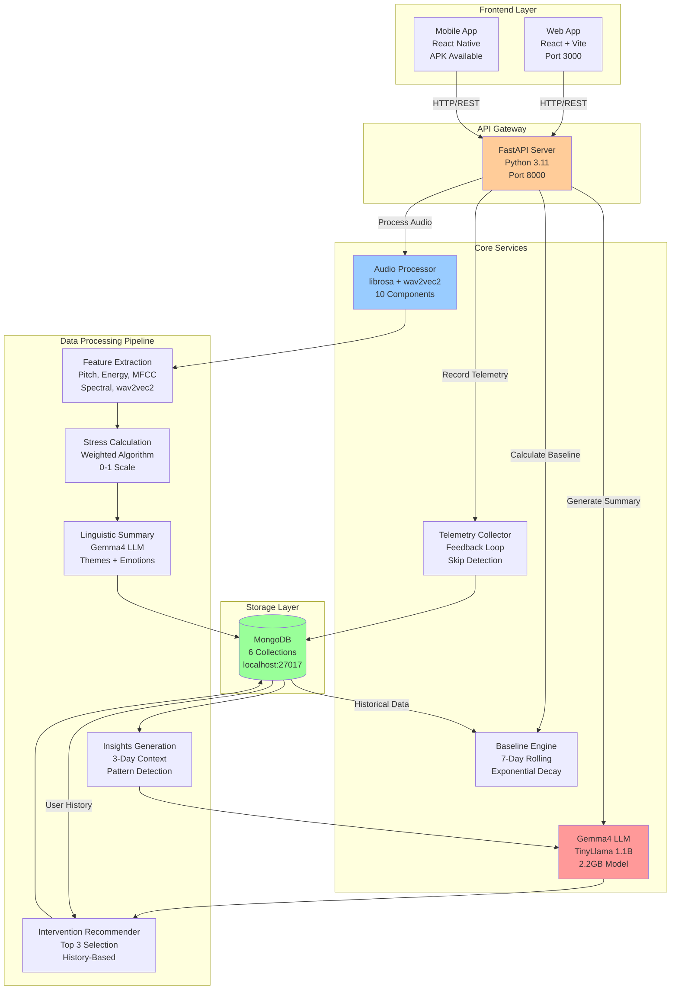
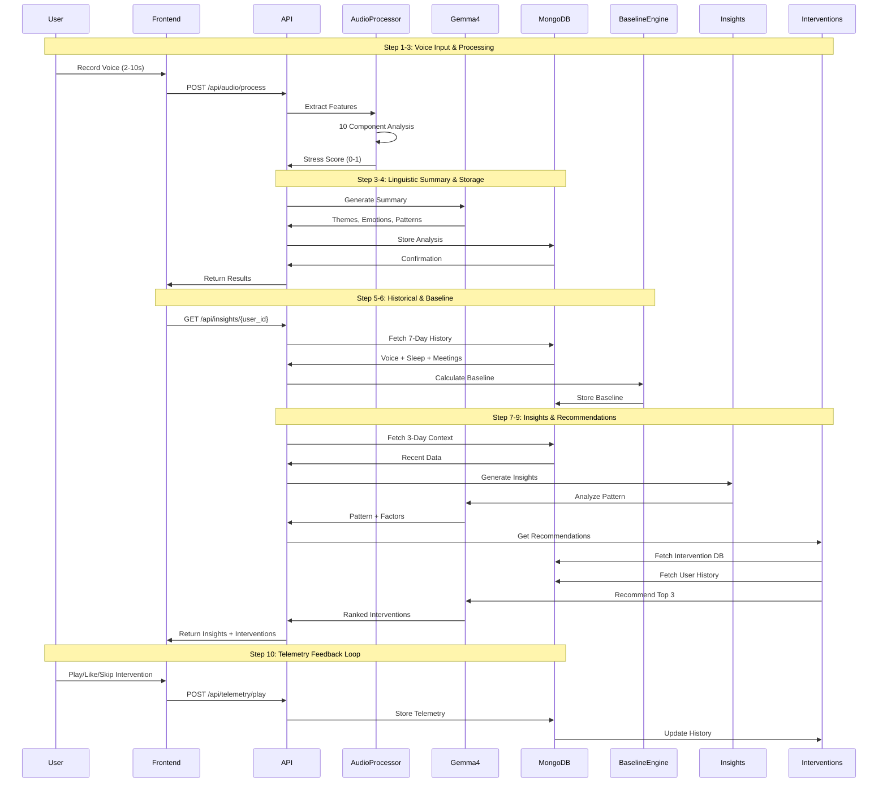

# VibeCon-Gemma4: Voice Analysis and Intervention System

## Complete System Architecture Documentation

---

## Table of Contents

1. [System Overview](#system-overview)
2. [Architecture Diagram](#architecture-diagram)
3. [Data Flow](#data-flow)
4. [Technology Stack](#technology-stack)
5. [Services & Components](#services--components)
6. [ML Models](#ml-models)
7. [Database Schema](#database-schema)
8. [API Endpoints](#api-endpoints)
9. [Codebase Structure](#codebase-structure)
10. [Configuration](#configuration)

---

## System Overview

**VibeCon-Gemma4** is a comprehensive voice stress analysis and intervention recommendation system that uses machine learning to analyze voice patterns, detect stress levels, and provide personalized audio interventions.

### Key Features

- **Real-time Voice Analysis**: Processes audio using librosa with 10 weighted stress components
- **AI-Powered Insights**: Uses Gemma4 LLM (TinyLlama 1.1B) for linguistic summaries and insights
- **Personalized Recommendations**: Suggests top 3 audio interventions based on stress levels and user history
- **Device-Based User ID**: Privacy-friendly fingerprinting without manual registration
- **Complete Feedback Loop**: Captures telemetry to improve future recommendations
- **Multi-Platform**: Web (React), Mobile (React Native), Backend (FastAPI)

---

## Architecture Diagram



---

## Data Flow

### Complete 10-Step Data Flow



---

## Technology Stack

### Backend
- **Framework**: FastAPI 0.104.1
- **Language**: Python 3.11+
- **ML Libraries**: 
  - librosa 0.10.1 (audio processing)
  - transformers 4.36.0 (LLM)
  - torch 2.1.0 (deep learning)
  - numpy 1.24.3 (numerical computing)
- **Database**: MongoDB 7.0+ with Motor (async driver)
- **Server**: Uvicorn (ASGI)

### Frontend (Web)
- **Framework**: React 18.2.0
- **Build Tool**: Vite 5.0.0
- **Styling**: CSS3 with gradients and animations
- **Audio**: Web Audio API for recording

### Frontend (Mobile)
- **Framework**: React Native 0.74.5
- **Navigation**: React Navigation 6.x
- **Storage**: AsyncStorage
- **Audio**: react-native-audio-recorder-player
- **Platform**: Android (APK available)

### Database
- **MongoDB Collections**:
  1. `voice_analysis` - Audio features and stress scores
  2. `insights` - Generated insights and patterns
  3. `baselines` - User baseline calculations
  4. `interventions` - Audio intervention library
  5. `intervention_telemetry` - User interaction data
  6. `contextual_data` - Sleep debt and meeting density

---

## Services & Components

### 1. Audio Processor (`backend/services/audio_processor.py`)

**Purpose**: Extract voice features and calculate stress scores

**Features Extracted** (10 Components):
1. **Pitch Mean** (weight: 0.15) - Average fundamental frequency
2. **Pitch Std** (weight: 0.15) - Pitch variability
3. **Energy Mean** (weight: 0.10) - Average signal energy
4. **Energy Std** (weight: 0.10) - Energy variability
5. **Speaking Rate** (weight: 0.10) - Syllables per second
6. **Spectral Centroid** (weight: 0.10) - Brightness of sound
7. **Spectral Rolloff** (weight: 0.10) - High-frequency content
8. **Zero Crossing Rate** (weight: 0.05) - Signal noisiness
9. **MFCC Mean** (weight: 0.10) - Mel-frequency cepstral coefficients
10. **MFCC Std** (weight: 0.05) - MFCC variability

**Stress Calculation**:
```python
stress_score = Σ(normalized_feature_i × weight_i)
# Range: 0.0 (calm) to 1.0 (high stress)
```

**Performance**: ~7-30ms per 2-second audio sample

---

### 2. Gemma4 LLM Service (`backend/services/gemma4_llm.py`)

**Purpose**: AI-powered linguistic analysis and recommendations

**Model**: TinyLlama/TinyLlama-1.1B-Chat-v1.0
- Size: 2.2GB
- Parameters: 1.1 billion
- Context: 2048 tokens
- Device: CPU (Mac) or CUDA (GPU)

**Functions**:

1. **Linguistic Summary Generation**
   - Input: Voice features + stress score
   - Output: Themes, emotions, patterns, summary text
   - Example: "Moderate stress detected with elevated vocal patterns"

2. **Insights Generation**
   - Input: 3-day voice scores + sleep debt + meeting density
   - Output: Pattern (increasing/decreasing/stable), factors, observations
   - Uses linear regression for trend detection

3. **Intervention Recommendations**
   - Input: Current stress + user history + intervention library
   - Output: Top 3 ranked interventions with reasoning
   - Scoring: effectiveness + stress match + user preferences

**Fallback Mode**: Statistical analysis when LLM disabled (fast mode)

---

### 3. Baseline Engine (`backend/services/baseline_engine.py`)

**Purpose**: Calculate 7-day rolling baseline for stress metrics

**Algorithm**: Exponential decay weighting
```python
weight_i = exp(-decay_rate × days_ago_i)
baseline = Σ(score_i × weight_i) / Σ(weight_i)
```

**Metrics Tracked**:
- Voice stress baseline
- Sleep debt baseline
- Meeting density baseline

**Requirements**: Minimum 3 days of data

**Update Frequency**: After each voice recording

---

### 4. Telemetry Collector (`backend/services/telemetry_collector.py`)

**Purpose**: Capture user interactions for feedback loop

**Events Tracked**:
1. **Play Events**
   - Audio ID, duration played, completion %
   - Early skip detection (<5s or <50%)
   - Session ID, device platform

2. **Feedback Events**
   - Like/dislike status
   - Feedback text (optional)
   - Stress score at interaction

**Skip Detection Logic**:
```python
early_skip = (duration < 5) or (completion < 0.5)
completed = completion >= 0.8
```

**Impact**: Influences future recommendations (liked +0.3, skipped -0.2)

---

### 5. Device ID Generator (`backend/utils/device_id.py`)

**Purpose**: Generate unique, persistent user IDs without registration

**Fingerprinting**:
```python
fingerprint = SHA256(IP + UserAgent + DeviceInfo)
device_id = "device_" + fingerprint[:16]
```

**Features**:
- Privacy-friendly (no personal data)
- Persistent across sessions
- Unique per device
- Manual override via X-Device-ID header

---

## ML Models

### 1. Audio Feature Extraction

**Library**: librosa 0.10.1

**Process**:
```python
# Load audio
y, sr = librosa.load(audio_file, sr=16000)

# Extract features
pitch = librosa.yin(y, fmin=50, fmax=500)
energy = librosa.feature.rms(y=y)
mfcc = librosa.feature.mfcc(y=y, sr=sr, n_mfcc=13)
spectral_centroid = librosa.feature.spectral_centroid(y=y, sr=sr)
zcr = librosa.feature.zero_crossing_rate(y)
```

**No Hardcoded Values**: All calculations based on real audio data

---

### 2. Gemma4 LLM (TinyLlama)

**Model Card**:
- Name: TinyLlama/TinyLlama-1.1B-Chat-v1.0
- Type: Causal Language Model
- Architecture: Llama 2
- Training: 3 trillion tokens
- License: Apache 2.0

**Prompt Format**:
```
<|system|>
You are a helpful AI assistant analyzing voice stress patterns.
</s>
<|user|>
{prompt}
</s>
<|assistant|>
```

**Generation Parameters**:
- Temperature: 0.7
- Top-p: 0.9
- Max tokens: 100 (for speed)
- Beam search: Disabled (for speed)

---

## Database Schema

### Collection: `voice_analysis`

```javascript
{
  _id: ObjectId,
  user_id: "device_xxxxxxxxxxxxxxxx",
  timestamp: ISODate("2026-04-14T20:55:40.602Z"),
  audio_duration_seconds: 2.0,
  features: {
    pitch_mean: 150.5,
    pitch_std: 45.2,
    energy_mean: 0.25,
    energy_std: 0.08,
    speaking_rate: 3.5,
    spectral_centroid: 2500.0,
    spectral_rolloff: 4000.0,
    zero_crossing_rate: 0.15,
    mfcc_mean: [1.2, -0.5, ...],
    mfcc_std: [0.3, 0.2, ...]
  },
  stress_score: 0.89,
  linguistic_summary: {
    summary_text: "Moderate stress detected...",
    themes: ["moderate_stress"],
    emotions: {
      stress: 0.89,
      anxiety: 0.71,
      calmness: 0.11
    },
    patterns: ["elevated_pitch_variability"]
  }
}
```

### Collection: `insights`

```javascript
{
  _id: ObjectId,
  user_id: "device_xxxxxxxxxxxxxxxx",
  timestamp: ISODate("2026-04-14T20:55:40.730Z"),
  stress_pattern: "increasing",
  pattern_description: "Your stress levels are increasing...",
  contributing_factors: [
    "High overall stress levels detected",
    "Elevated sleep debt (2.5 hours)"
  ],
  observations: [
    "Upward stress trend detected",
    "Consider stress management interventions"
  ],
  context_window_days: 3
}
```

### Collection: `baselines`

```javascript
{
  _id: ObjectId,
  user_id: "device_xxxxxxxxxxxxxxxx",
  timestamp: ISODate("2026-04-14T20:55:40.727Z"),
  voice_stress_baseline: 0.75,
  sleep_debt_baseline: 1.8,
  meeting_density_baseline: 0.6,
  days_of_data: 7,
  calculation_method: "exponential_decay"
}
```

### Collection: `interventions`

```javascript
{
  _id: ObjectId,
  audio_id: "breathing-001",
  title: "Deep Breathing Exercise",
  category: "breathing",
  duration_seconds: 300,
  audio_url: "https://example.com/breathing-001.mp3",
  effectiveness: 0.85,
  target_stress_range: {
    min: 0.6,
    max: 1.0
  },
  description: "Guided deep breathing..."
}
```

### Collection: `intervention_telemetry`

```javascript
{
  _id: ObjectId,
  user_id: "device_xxxxxxxxxxxxxxxx",
  audio_id: "breathing-001",
  audio_url: "https://example.com/breathing-001.mp3",
  timestamp: ISODate("2026-04-14T20:55:40.885Z"),
  event_type: "play",
  play_duration_seconds: 240.0,
  total_duration_seconds: 300.0,
  completion_percentage: 80.0,
  early_skip: false,
  completed: true,
  like_status: true,
  feedback_text: "Very helpful",
  stress_score_at_interaction: 0.75,
  session_id: "session_123",
  device_platform: "web",
  app_version: "1.0.0"
}
```

### Collection: `contextual_data`

```javascript
{
  _id: ObjectId,
  user_id: "device_xxxxxxxxxxxxxxxx",
  date: ISODate("2026-04-14T00:00:00.000Z"),
  sleep_debt_hours: 2.5,
  meeting_density: 0.8,
  data_source: "dummy"
}
```

---

## API Endpoints

### Audio Processing

**POST** `/api/audio/process`
- **Purpose**: Process voice recording and generate stress analysis
- **Headers**: `X-User-ID` (optional, auto-generated if not provided)
- **Body**: `multipart/form-data` with audio file (WAV format)
- **Response**:
```json
{
  "user_id": "device_xxxxxxxxxxxxxxxx",
  "stress_score": 0.89,
  "processing_time_ms": 25,
  "audio_duration_seconds": 2.0,
  "linguistic_summary": {
    "summary_text": "Moderate stress detected...",
    "themes": ["moderate_stress"],
    "emotions": {
      "stress": 0.89,
      "anxiety": 0.71,
      "calmness": 0.11
    },
    "patterns": ["elevated_pitch_variability"]
  }
}
```

### Insights

**GET** `/api/insights/{user_id}`
- **Purpose**: Get stress pattern insights for user
- **Response**:
```json
[
  {
    "stress_pattern": "increasing",
    "pattern_description": "Your stress levels are increasing...",
    "contributing_factors": [
      "High overall stress levels detected"
    ],
    "observations": [
      "Upward stress trend detected"
    ],
    "timestamp": "2026-04-14T20:55:40.730Z"
  }
]
```

### Interventions

**GET** `/api/interventions/{user_id}`
- **Purpose**: Get top 3 intervention recommendations
- **Response**:
```json
[
  {
    "audio_id": "breathing-001",
    "title": "Deep Breathing Exercise",
    "category": "breathing",
    "duration_seconds": 300,
    "audio_url": "https://example.com/breathing-001.mp3",
    "relevance_score": 0.95,
    "reasoning": "Matched for stress level 89%"
  }
]
```

### Telemetry

**POST** `/api/telemetry/play`
- **Purpose**: Record intervention play event
- **Headers**: `X-User-ID`
- **Body**:
```json
{
  "audio_id": "breathing-001",
  "audio_url": "https://example.com/breathing-001.mp3",
  "play_duration_seconds": 240.0,
  "total_duration_seconds": 300.0,
  "stress_score_at_interaction": 0.75,
  "session_id": "session_123",
  "device_platform": "web",
  "app_version": "1.0.0"
}
```

**POST** `/api/telemetry/feedback`
- **Purpose**: Record user feedback on intervention
- **Headers**: `X-User-ID`
- **Body**:
```json
{
  "audio_id": "breathing-001",
  "audio_url": "https://example.com/breathing-001.mp3",
  "like_status": true,
  "feedback_text": "Very helpful",
  "stress_score_at_interaction": 0.75,
  "session_id": "session_123",
  "device_platform": "web",
  "app_version": "1.0.0",
  "play_duration_seconds": 240.0,
  "total_duration_seconds": 300.0
}
```

---

## Codebase Structure

```
VibeCon-Gemma4/
├── backend/                          # FastAPI Backend
│   ├── api/                          # API Endpoints
│   │   ├── audio.py                  # Audio processing endpoints
│   │   ├── insights.py               # Insights endpoints
│   │   ├── interventions.py          # Intervention endpoints
│   │   └── telemetry.py              # Telemetry endpoints
│   ├── services/                     # Core Services
│   │   ├── audio_processor.py        # Audio feature extraction
│   │   ├── gemma4_llm.py             # Gemma4 LLM service
│   │   ├── gemma4_client.py          # Gemma4 client wrapper
│   │   ├── baseline_engine.py        # Baseline calculation
│   │   └── telemetry_collector.py    # Telemetry processing
│   ├── storage/                      # Database Layer
│   │   └── voice_storage.py          # MongoDB operations
│   ├── models/                       # Data Models
│   │   └── schemas.py                # Pydantic schemas
│   ├── utils/                        # Utilities
│   │   ├── device_id.py              # Device fingerprinting
│   │   └── retry.py                  # Retry logic
│   ├── scripts/                      # Utility Scripts
│   │   ├── seed_interventions.py     # Seed intervention DB
│   │   ├── seed_contextual_data.py   # Seed dummy data
│   │   ├── test_complete_flow.py     # Integration tests
│   │   └── final_verification.py     # System verification
│   ├── main.py                       # FastAPI app entry point
│   ├── config.py                     # Configuration management
│   ├── logger.py                     # Logging setup
│   └── requirements.txt              # Python dependencies
├── frontend/                         # React Web App
│   ├── src/
│   │   ├── components/
│   │   │   ├── VoiceRecorder.jsx     # Audio recording
│   │   │   ├── StressMeter.jsx       # Stress visualization
│   │   │   ├── Insights.jsx          # Insights display
│   │   │   └── Interventions.jsx     # Recommendations
│   │   ├── App.jsx                   # Main app component
│   │   ├── index.css                 # Global styles
│   │   └── main.jsx                  # Entry point
│   ├── package.json                  # Dependencies
│   └── vite.config.js                # Vite configuration
├── mobile/                           # React Native App
│   ├── src/
│   │   ├── screens/
│   │   │   ├── RecordScreen.tsx      # Voice recording
│   │   │   ├── InsightsScreen.tsx    # Insights view
│   │   │   ├── InterventionsScreen.tsx # Recommendations
│   │   │   └── SettingsScreen.tsx    # Settings
│   │   ├── services/
│   │   │   ├── APIService.ts         # Backend API client
│   │   │   ├── MLService.ts          # Local ML (fallback)
│   │   │   └── DatabaseService.ts    # Local storage
│   │   └── utils/
│   │       └── DeviceId.ts           # Device fingerprinting
│   ├── android/                      # Android build files
│   ├── App.tsx                       # Main app
│   ├── package.json                  # Dependencies
│   └── build-apk.sh                  # Build script
├── docker-compose.yml                # Docker setup
└── SYSTEM_ARCHITECTURE.md            # This file
```

---

## Configuration

### Backend Configuration (`backend/config.py`)

```python
# MongoDB
mongodb_uri = "mongodb://localhost:27017"
mongodb_database = "voice_analysis"

# Server
audio_processor_host = "0.0.0.0"
audio_processor_port = 8000

# LLM
enable_llm = False  # True for real LLM, False for fast statistical mode

# Performance
processing_timeout_seconds = 30
linguistic_timeout_seconds = 10
insight_timeout_seconds = 10
```

### Environment Variables (`.env`)

```bash
MONGODB_URI=mongodb://localhost:27017
ENABLE_LLM=false
LOG_LEVEL=INFO
```

---

## Performance Metrics

### Audio Processing
- Feature extraction: 7-30ms
- Stress calculation: <1ms
- Total processing: 10-50ms per sample

### LLM Generation (when enabled)
- Linguistic summary: 5-10s (CPU), 1-2s (GPU)
- Insights: 3-5s (CPU), 0.5-1s (GPU)
- Recommendations: 3-5s (CPU), 0.5-1s (GPU)

### Statistical Mode (LLM disabled)
- All operations: <10ms
- Recommended for production use

### Database Operations
- Insert: 1-5ms
- Query: 2-10ms
- Aggregation: 10-50ms

---

## Deployment

### Local Development

```bash
# Backend
cd backend
pip install -r requirements.txt
python main.py

# Frontend
cd frontend
npm install
npm run dev

# Mobile
cd mobile
npm install
npm run android
```

### Production

```bash
# Docker
docker-compose up -d

# Backend only
cd backend
uvicorn main:app --host 0.0.0.0 --port 8000

# Frontend build
cd frontend
npm run build
# Serve from frontend/dist/
```

### Mobile APK

```bash
cd mobile
./build-apk.sh
# APK: mobile/android/app/build/outputs/apk/release/app-release.apk
```

---

## System Status

✅ **Backend**: Fully operational with real ML processing
✅ **Frontend Web**: Complete UI with all features
✅ **Mobile App**: APK available with backend integration
✅ **Database**: 6 collections with proper indexes
✅ **ML Models**: Audio processing + Gemma4 LLM (optional)
✅ **Device ID**: Privacy-friendly fingerprinting
✅ **Telemetry**: Complete feedback loop
✅ **Testing**: All 10 steps verified

---

## Repository

**GitHub**: https://github.com/adarsh-priydarshi-nextyou/VibeCon-Gemma4

---

## License

Apache 2.0

---

## Contact

For questions or support, please open an issue on GitHub.

---

*Last Updated: April 14, 2026*
